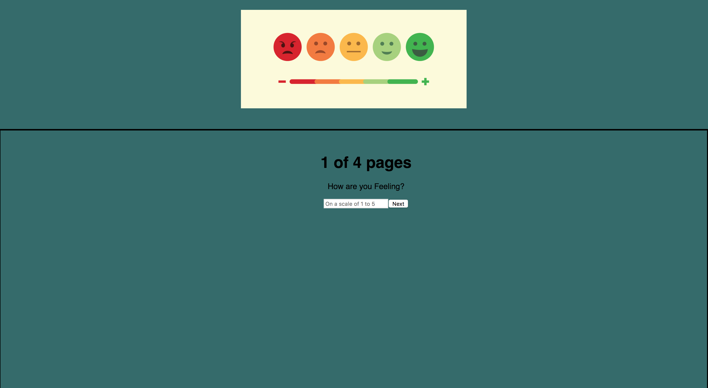

# Survey Says

This is a survey application that asks you four questions. You can rate how you are feeling on a scale of 1-5 and once you complete the questions you can start over and leave more feedback. On localadmin/3000/admin you will be able to see a table of all the feedback that has been recorded. 

### Setup


```
SQL - Database


CREATE DATABASE "prime_feedback";


CREATE TABLE "feedback" (
  "id" serial primary key,
  "feeling" INT not null,
  "understanding" INT not null,
  "support" INT not null,
  "comments" text,
  "flagged" boolean default false,
  "date" date not null default CURRENT_DATE
); 


INSERT INTO "feedback" ("feeling", "understanding", "support", "comments")
VALUES (4, 4, 5, 'Doing Great!');
```

```
download project
npm install
npm run server
```

Now that the server is running, open a new terminal tab with `cmd + t` and start the react client app.

```
npm run client
```

Between the server and client, you'll need two terminal tabs! Because we're using `nodemon`, both our client side and server side will automatically spin back up when changes are made!

## Built with these technologies:
- HTML
- CSS
- JAVASCRIPT
- SQL
- EXPRESS
- React.JS
- React Redux
- NODE.JS
## Screen Shot


## Completed features
- [x] Created components for the header, page one, page two, page three, page four, page five, and admin
- [x] Created different routes for each page 
- [x] Created routes for GET, POST, DELETE
- [x] Added pg to communicate database
- [x] Added server side routes to communicate back with client
    * create(POST)
    * read(GET)
    * delete (DELETE)
- [x] Added CSS styling to HTML
- [x] Added database 

### Next Steps
Features that I would like to add to this project are:
* Adding more CSS features and Material UI

### Authors
Lais Vang

#### Acknowledgments
* CSS Styling: W3 School
